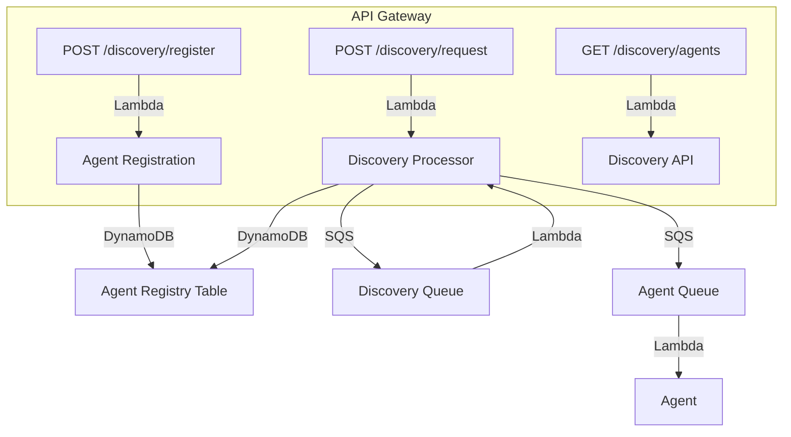

# Agent Discovery System Architecture

## Overview

The Agent Discovery system enables autonomous agents to register themselves, discover other agents based on capabilities, and communicate asynchronously for collaborative task execution. The system is built on AWS using serverless and managed services for scalability and reliability.

## Components

### 1. API Gateway
- Exposes RESTful endpoints for agent registration, discovery, and listing.
- Routes requests to Lambda functions.

### 2. Lambda Functions
- **discovery_api.py**: Handles API Gateway requests for registration, discovery, and listing agents.
- **discovery_processor.py**: Processes discovery requests from SQS, matches agents, and sends responses.
- **agent_registration.py**: Handles agent registration events from SQS and updates the registry.

### 3. DynamoDB
- **Agent Registry Table**: Stores agent metadata, capabilities, and status.
- **Discovery Requests Table** (optional): Stores discovery requests and results for asynchronous processing.

### 4. SQS Queues
- **Discovery Queue**: Receives discovery requests for asynchronous processing.
- **Agent Queue**: Delivers messages and tasks to agents.

### 5. CDK Infrastructure
- All resources are defined and deployed using AWS CDK (Python).

## Data Flow

## Sequence Example: Agent Discovery

1. Agent A registers via `POST /discovery/register`.
2. Agent B submits a discovery request via `POST /discovery/request`.
3. The request is placed on the Discovery Queue.
4. The Discovery Processor Lambda matches agents and sends results to Agent B via the Agent Queue.

## Security
- IAM roles restrict Lambda access to only required resources.
- API Gateway can be secured with API keys or Cognito (optional).

## Extensibility
- Add new agent types by extending the agent template.
- Add new capabilities and matching logic in the discovery processor.
- Integrate with additional AWS services as needed.

## Deployment
- All infrastructure is deployed using the CDK stack in `infra/cdk`.
- See `README.md` for deployment instructions. 